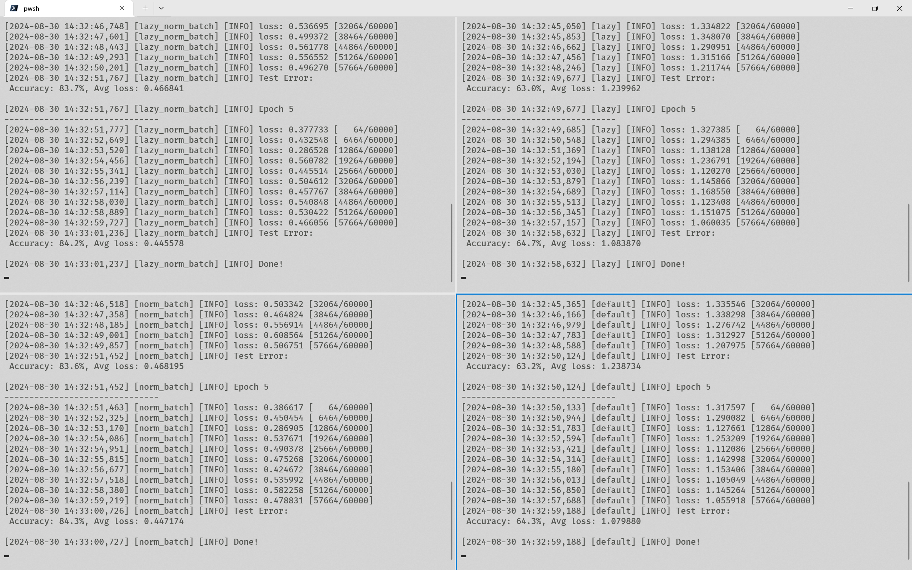

+++
title = 'Batch Norm加速效果明显，Lazy层不影响精准度'
date = 2024-08-30T13:34:25+08:00
draft = true
categories = ['Machine Learning']
tags = ['PyTorch', 'Batch Normalization']
+++

<details>
<summary>测试代码</summary>

```python
import logging
import logging.handlers
from dataclasses import dataclass

import torch
import torch.multiprocessing as mp
from torch import nn
from torch.utils.data import DataLoader
from torchvision import datasets
from torchvision.transforms import ToTensor

training_data = datasets.FashionMNIST(
    root="data", train=True, download=True, transform=ToTensor()
)
test_data = datasets.FashionMNIST(
    root="data", train=False, download=True, transform=ToTensor()
)

batch_size = 64

dataloader_train = DataLoader(training_data, batch_size=batch_size)
dataloader_test = DataLoader(test_data, batch_size=batch_size)

for X, y in dataloader_test:
    print(f"Shape of X [N, C, H, W]: {X.shape}")
    print(f"Shape of y: {y.shape} {y.dtype}")
    break

loss_fn = nn.CrossEntropyLoss()

device = (
    "cuda"
    if torch.cuda.is_available()
    else "mps" if torch.backends.mps.is_available() else "cpu"
)
print(f"Using {device} device")


class NN(nn.Module):
    def __init__(self, lazy=True, norm_batch=True):
        super().__init__()
        self.flatten = nn.Flatten()
        match lazy, norm_batch:
            case True, True:
                self.linear_relu_stack = nn.Sequential(
                    nn.LazyLinear(512, bias=False),
                    nn.LazyBatchNorm1d(),
                    nn.ReLU(),
                    nn.LazyLinear(512, bias=False),
                    nn.LazyBatchNorm1d(),
                    nn.ReLU(),
                    nn.LazyLinear(10),
                )
            case True, False:
                self.linear_relu_stack = nn.Sequential(
                    nn.LazyLinear(512),
                    nn.ReLU(),
                    nn.LazyLinear(512),
                    nn.ReLU(),
                    nn.LazyLinear(10),
                )
            case False, True:
                self.linear_relu_stack = nn.Sequential(
                    nn.Linear(28 * 28, 512, bias=False),
                    nn.BatchNorm1d(512),
                    nn.ReLU(),
                    nn.Linear(512, 512, bias=False),
                    nn.BatchNorm1d(512),
                    nn.ReLU(),
                    nn.Linear(512, 10),
                )
            case False, False:
                self.linear_relu_stack = nn.Sequential(
                    nn.Linear(28 * 28, 512),
                    nn.ReLU(),
                    nn.Linear(512, 512),
                    nn.ReLU(),
                    nn.Linear(512, 10),
                )

    def forward(self, x):
        x = self.flatten(x)
        x = self.linear_relu_stack(x)
        return x


def dry_run_lazy_model(model):
    X = torch.rand(64, 1, 28, 28, device=device)
    model(X)


def train_epoch(dataloader: DataLoader, model, loss_fn, optimizer, logger, device):
    size = len(dataloader.dataset)
    model.train()
    for batch, (X, y) in enumerate(dataloader):
        X, y = X.to(device), y.to(device)

        pred = model(X)
        loss = loss_fn(pred, y)

        loss.backward()
        optimizer.step()
        optimizer.zero_grad()

        if batch % 100 == 0:
            loss, current = loss.item(), (batch + 1) * len(X)
            logger.info(f"loss: {loss:>7f} [{current:>5d}/{size:>5d}]")


def test_epoch(dataloader, model, loss_fn, logger, device):
    size = len(dataloader.dataset)
    num_batches = len(dataloader)
    model.eval()
    test_loss, correct = 0, 0
    with torch.no_grad():
        for X, y in dataloader:
            X, y = X.to(device), y.to(device)
            pred = model(X)
            test_loss += loss_fn(pred, y).item()
            correct += (pred.argmax(1) == y).type(torch.float).sum().item()
    test_loss /= num_batches
    correct /= size
    logger.info(
        f"Test Error: \n Accuracy: {(100*correct):>0.1f}%, Avg loss: {test_loss:>8f}\n"
    )


@dataclass
class ProcessArgs:
    lazy: bool
    norm_batch: bool
    port: int


def train(process_args: ProcessArgs):
    match process_args.lazy, process_args.norm_batch:
        case True, True:
            log_name = "lazy_norm_batch"
        case True, False:
            log_name = "lazy"
        case False, True:
            log_name = "norm_batch"
        case False, False:
            log_name = "default"
    logger = logging.getLogger(log_name)
    logger.setLevel(logging.DEBUG)
    logger.addHandler(logging.handlers.SocketHandler("localhost", process_args.port))

    model = NN(process_args.lazy, process_args.norm_batch).to(device)
    if process_args.lazy:
        dry_run_lazy_model(model)

    optimizer = torch.optim.SGD(model.parameters(), lr=1e-3)

    epochs = 5
    for t in range(epochs):
        logger.info(f"Epoch {t+1}\n-------------------------------")
        train_epoch(dataloader_train, model, loss_fn, optimizer, logger, device)
        test_epoch(dataloader_test, model, loss_fn, logger, device)
    logger.info("Done!")


def main():
    process_args_list = [
        # fmt: off
        ProcessArgs(lazy=True,  norm_batch=True,  port=9990),
        ProcessArgs(lazy=True,  norm_batch=False, port=9991),
        ProcessArgs(lazy=False, norm_batch=True,  port=9992),
        ProcessArgs(lazy=False, norm_batch=False, port=9993),
        # fmt: on
    ]

    with mp.Pool(processes=len(process_args_list)) as pool:
        pool.map(train, process_args_list)


if __name__ == '__main__':
    main()

```

</details>

运行结果：

| Config           | Accuracy(%) |
| ---------------- | ----------- |
| Lazy + BatchNorm | 84.2        |
| Lazy             | 64.7        |
| BatchNorm        | 84.3        |
| Baseline         | 64.3        |



## Conclusion

- BatchNorm对模型精准度有明显提升，尽量配合`bias=False`成为基本配置
- Lazy层对精准度影响不大，为了方面coding，可以使用Lazy层
