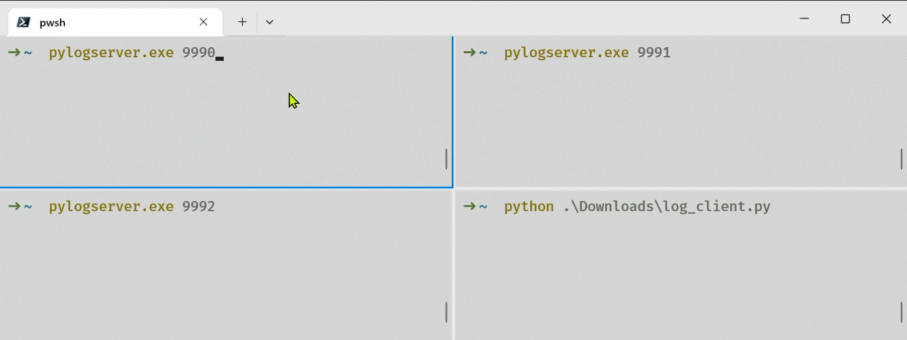

+++
title = '终端并发输出'
date = 2024-08-26T21:23:41+08:00
draft = true
categories = ['Utility']
tags = ['Terminal', 'Concurrent']
+++

## 背景

如果需要并发运行某个/些命令，且它们有各自的输出，如果把它们放在同一个终端窗口中，输出会混在一起，不易阅读。

## 基于终端

把它们分开到不同window/pane中是一个解决方案，具体操作取决于终端。

### Windows Terminal

```powershell
wt -M python main.py `; `
    sp python main.py `; `
    sp python main.py `; `
    mf left `; `
    sp python main.py
```

> 由于`wt`的命令形式为`wt [options] [subcommand; ...]`，所以在附加多个`subcommand`时，为了避免分号被解释为命令分隔符，需要将`;`转义，即`反引号+分号`
>
> 行尾的`空格+反引号`则是续行符


<details>
<summary> <code>main.py</code> </summary>

```python
import multiprocessing as mp
import time
import os


def f():
    for i in range(3):
        print(f'[{os.getppid()}-{os.getpid()}] {i}')
        time.sleep(1)


if __name__ == '__main__':
    p = mp.Process(target=f)
    p.start()
    p.join()
    input('Press Enter to exit')
```

</details>

## 基于Socket

如果只想运行一次脚本，可以考虑使用socket通信。

以`Python`的`logging`模块为例:

服务器端可采用`pylogserver-aquanjsw`包;

<details>
<summary> 客户端示例 </summary>

```python
import logging
import logging.handlers
import multiprocessing as mp
import os
import time


def job(port):
    logger = logging.getLogger(str(os.getpid()))
    logger.setLevel(logging.DEBUG)
    logger.addHandler(logging.handlers.SocketHandler("localhost", port))
    for i in range(3):
        logger.info(f"Message {i}")
        time.sleep(1)


def main():
    with mp.Pool(processes=4) as pool:
        pool.map(job, [9990, 9991, 9992])


if __name__ == '__main__':
    main()

```

</details>

运行示例：



## Reference

- [Windows Terminal: 命令行参数](https://learn.microsoft.com/zh-cn/windows/terminal/command-line-arguments?tabs=windows)
